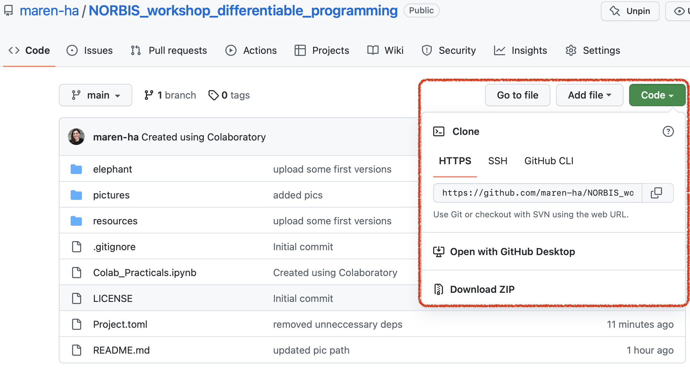
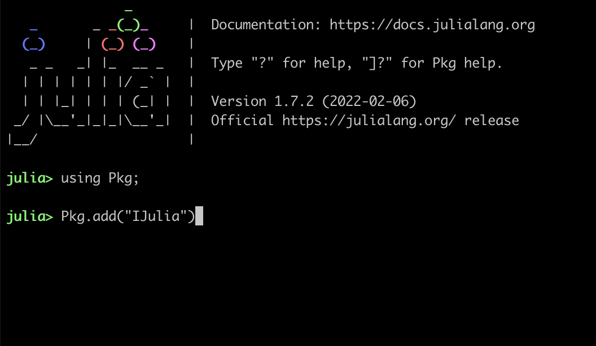
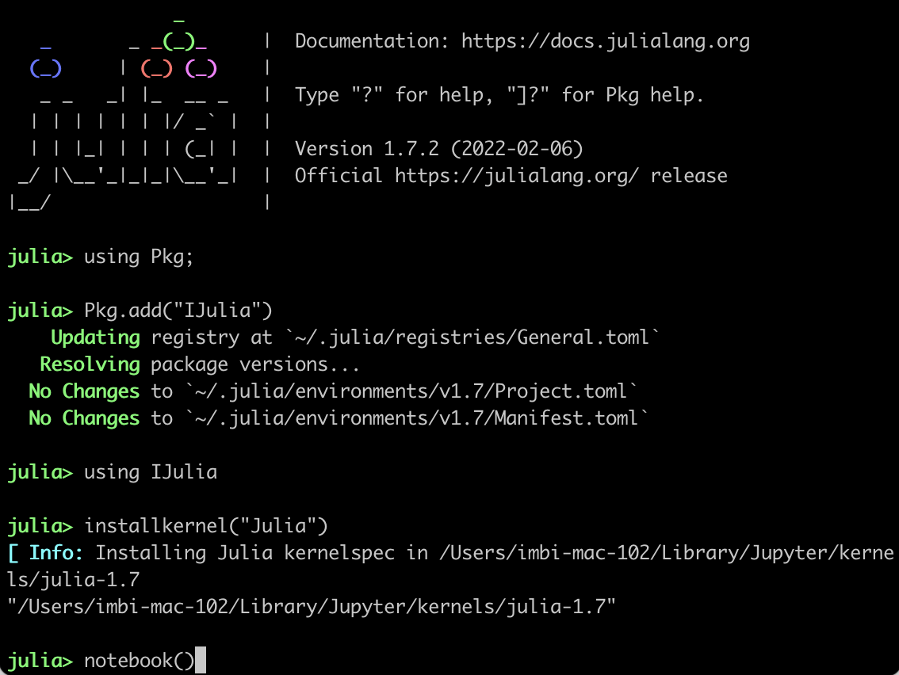
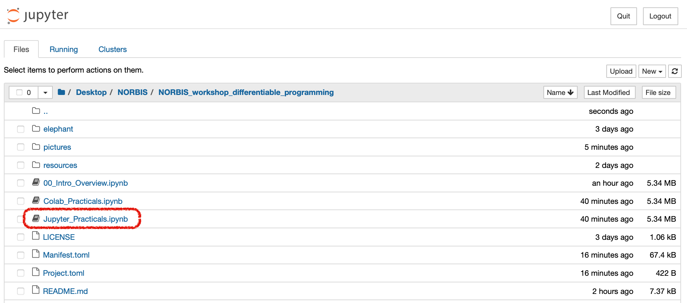

# NORBIS workshop on differentiable programming

This repository contains code, notebooks and further materials for the workshop on 

**Differentiable programming for flexible modelling with small data** 

to be held at the 8th Annual NORBIS conference, October 24-28, Rosendal (Norway). 

## Introduction 

### What is differentiable programming? 

The success of deep learning in recent years has been fuelled by large volumes of data, such as massive image datasets, that have made purely data-driven modelling by neural networks feasible. 
However, in many biomedical applications only a much smaller number of observations is available, such that modelling is typically based on the assumption of a more restricted, explicit underlying data-generating model, e.g., a regression model or a system of differential equations. This lacks the flexibility and expressiveness of deep learning models but facilitates explainable knowledge-driven modelling in small data settings. 

Instead of viewing these modelling paradigms as opposing approaches to data analysis, the recently proposed concept of *differentiable programming* allows for combining their respective advantages and thus addressing complex modelling challenges, in particular for biomedical small data problems. Specifically, differentiable programming facilitates designing models that comprise several potentially distinct building blocks, e.g., neural networks and differential equations, and jointly optimise all model components. This is done by implementing a joint model loss function and using automatic differentiation to get parameter estimates for all model components for gradient-based optimisation. 

### What to expect in this workshop

In this workshop, participants will get familiar with differentiable programming in theory and practice and will get hands-on experience on an exemplary biomedical small data problem tackled by differentiable programming. In the first part of the workshop, the participants will gain a deeper understanding of the core ideas and inner workings of differentiable programming through demo code examples to see the technique "in action", group reading and discussions. The second part of the workshop will focus on hands-on coding examples provided in Colab or Jupyter notebooks. Specifically, we will re-implement a [more complex model](https://github.com/maren-ha/DeepDynamicModelingWithJust2TimePoints) that integrates neural networks and differential equations to infer patients' disease trajectories in a small data scenario.

## Workshop schedule 

**Tuesday, October 25, 2022**
| :alarm_clock: | :point_down: |
| ------------- | ------------ |
| 9:00 - 9:15   | Welcome :wave:                                                             |
| 9:15 - 9:35   | Intro to small data and differentiable programming - demo examples :computer:                                                    |
| 9:35 - 10:30  | What is differentiable programming? - core concepts :books: + :speech_balloon:                           |
| 10:30 - 11:00 | Coffee break :coffee:                                                           |
| 11:00 - 11:30 | Differentiable programming + small data concepts ctd. :speech_balloon: :pencil:                           |
| 11:30 - 12:30 | Neural networks + dynamic modeling for a small data challenge - hands-on :clap: :computer: |

## How to access the code notebooks 

I recommend that you access the code notebooks for the second, hands-on part of the workshop via [Google Colab](https://colab.research.google.com), see below for more details. This will install Julia and all packages on your Google Colab runtime and require no local installation. 

Alternatively, you can access the notebooks based on [Jupyter](https://jupyter.org). This requires a local installation of Julia and the `IJulia` package for working with Jupyter notebook inside Julia. 

***Step 1:*** **Clone or download** this repository to your computer: On the Github page, click the green "code" button, and copy the url to clone the repo or click on "download zip", and then extract. 

***Next steps:*** Depending on whether you use Google Colab to run the notebook (recommended) or Jupyter notebooks. Please read below for details. 

### a) using Google Colab (recommended)

* ***Prerequisites:*** You need a Google account (and a small bit of free space on your Google Drive). 
* ***Pros:*** Requires no local installation of Julia, no OS-dependent intricacies when installing packages etc.   
* ***Cons:*** You have to re-install Julia and all the required packages again whenever your Colab runtime crashes or restarts, which will take some time (~ 5-10 minutes). 
* ***Instructions:***
  * get a copy of the notebook to your Google Drive: Open the notebook...  
   * ... and create a copy in your Google Drive 
> :zap: **Very important**:zap: Please make a copy of the notebook **straight away** or upload the `Colab_Practicals.ipynb` file from the repository to your Google Drive, so that you have a copy in your own Google Drive! Otherwise you will not be able to save it and any changes you do in the notebook will be lost after you close the tab. 
* After you have copied the notebook to your drive: 
  * run the first cell to install the Julia kernel 
  * re-load the page (by clicking on the :leftwards_arrow_with_hook: icon in the address line of the browser or pressing Ctrl + R)
  *  upload the [`Project.toml` file](https://github.com/maren-ha/NORBIS_workshop_differentiable_programming/blob/main/Project.toml) from this repo to your Google Drive (Click on "Files" in the left menu, then on the upload icon, then select the file)
   * proceed by running the next cells, which check the installation and install the package dependencies

### b) using Jupyter 

If you don't have a Google account, or prefer to have everything installed locally on your computer, you can use Julia inside Jupyter. 

* ***Pros:*** Afer you have installed everything once, you can easily go back and modify things and play around, without having to wait for all packages to be installed and precompiled again on a fresh Colab runtime. Everything will already be there and much faster after first precompilation. 
* ***Cons:*** You have to install Julia and all the required packages locally on your computer, which can sometimes cause the usual conflicting versions issues etc., and might need some manual debugging at first (but it's typically really smooth, I do encourage you to try it out anyway :wink:)
* ***Instructions:***
  * download and install Julia: either the [current stable release v1.8](https://julialang.org/downloads/#current_stable_release) or v1.7.2, which I've installed in the Google Colab environment, available from the [older releases page](https://julialang.org/downloads/oldreleases/). 
  * open Julia (OS-dependent, but you should generally find a Julia icon somewhere in your programs or applications folder, on which you can double-click)
  * you should see the Julia REPL. Type in the following commands
    * `using Pkg` to use the package manager, 
    * `Pkg.add("IJulia")` to add the `IJulia` package needed to run Jupyter notebooks 
    * `using IJulia` to include the package
    * `installkernel("Julia")` to install the Julia kernel for Jupyter
    * `notebook()` to open a fresh Jupyter instance
  
    * navigate to your local copy of the workshop repository in your file system and open the `Jupyter_Practicals.ipynb` file
  

For more details on IJulia, see [the docs](https://julialang.github.io/IJulia.jl/stable/).

## What's in this repository? 

outline structure

## A note about my choice of programming language 

All code for the workshop notebooks is written in [Julia](https://julialang.org). Since I am often asked "why Julia?!", here are some of my personal reasons: Julia...

* is a young programming language developed as a fresh and pragmatic approach to scientific computing, combining performance and speed with ease of use
* provides a "low-barrier approach" to state-of-the-art methods development for biostatistics 
* allows for easily picking up emerging modelling trends, such as differentiable programming, which requires straightforward access to automatic differentiation libraries
*  allows to more readily implement scientific ideas that researchers might not have pursued with other tools, specifically when it comes to flexibly integrating different modelling paradigms. 

I will showcase this flexibility in a small data scenario, where combining deep learning with dynamic modelling allows for describing individual-specific disease trajectories, despite a relatively small number of patients and few and irregular follow-up time points, based on [our paper](https://doi.org/10.1002/bimj.202000366).

If you want to know more, I've uploaded the slides of a talk I recently gave about why I use Julia in the `resources` subfolder :blush: